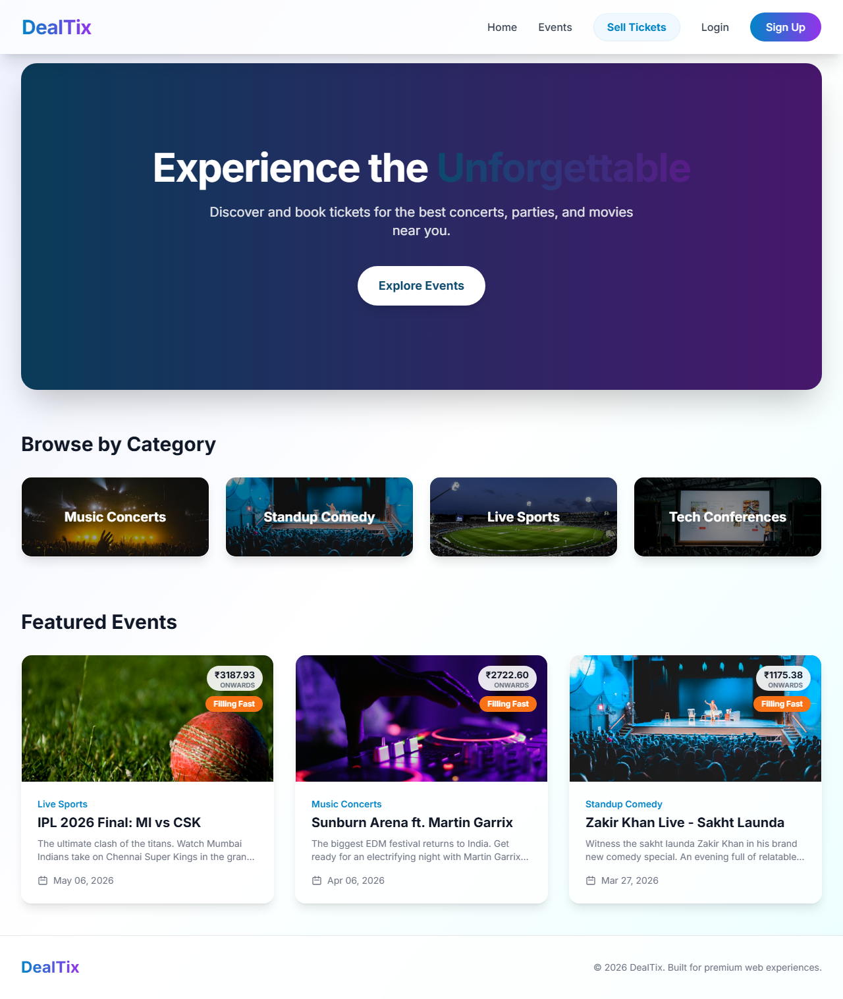
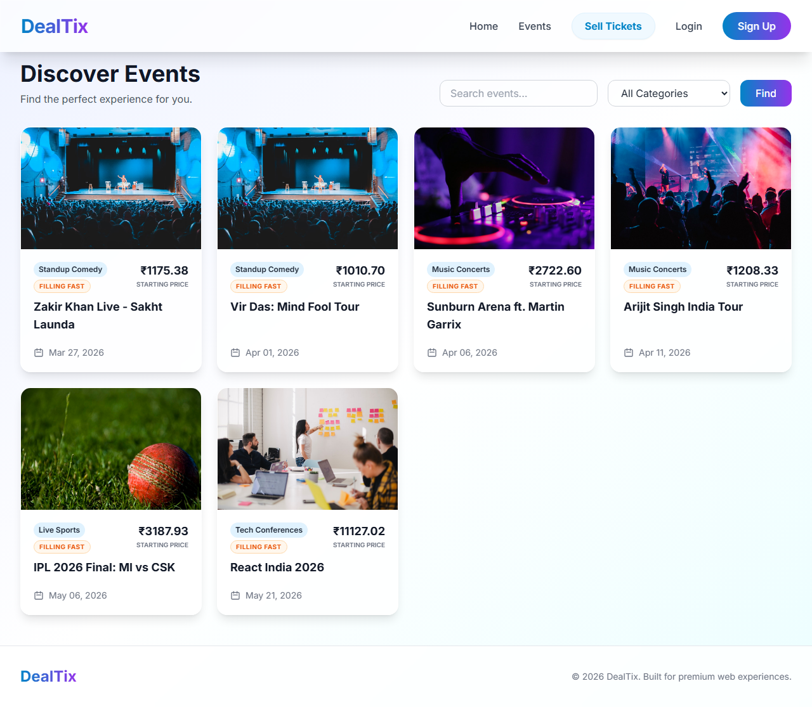
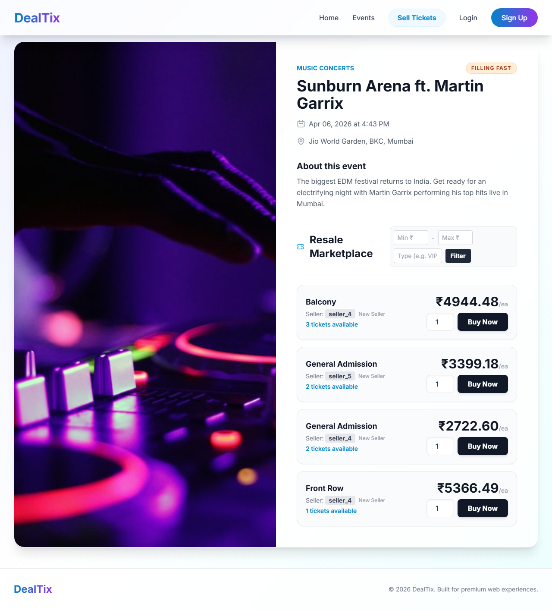
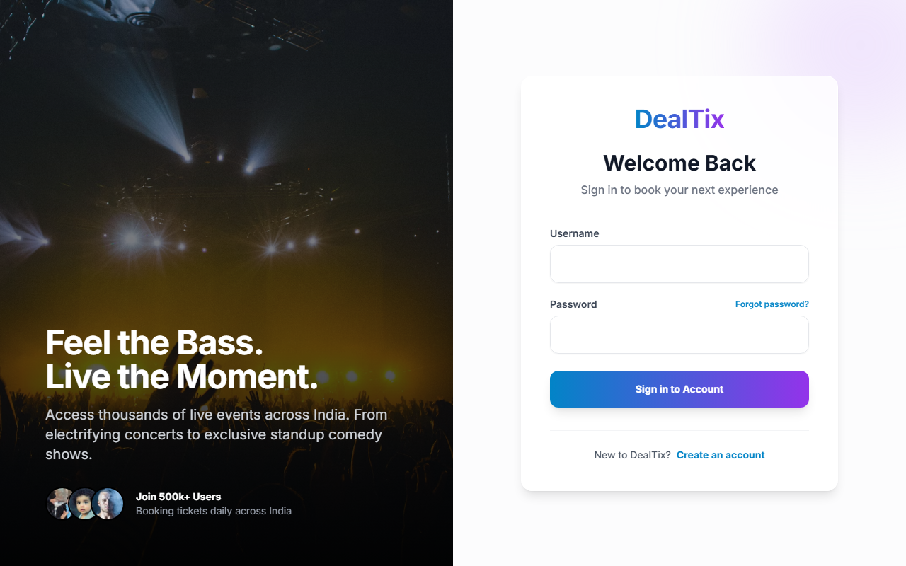
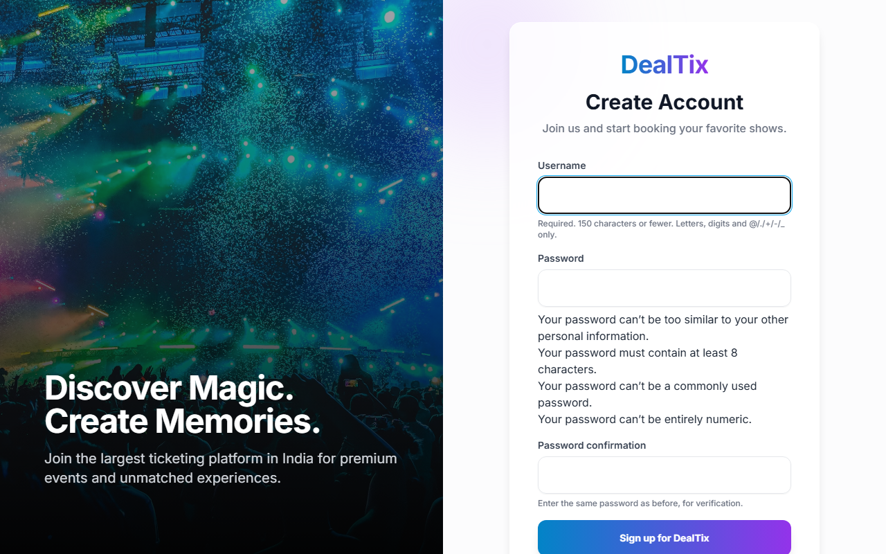
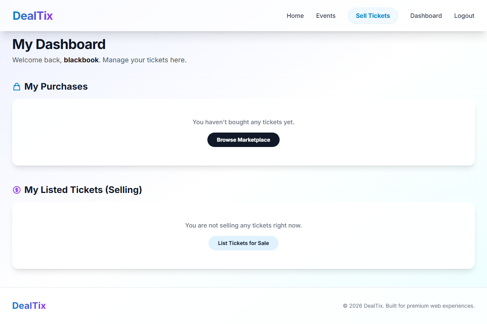
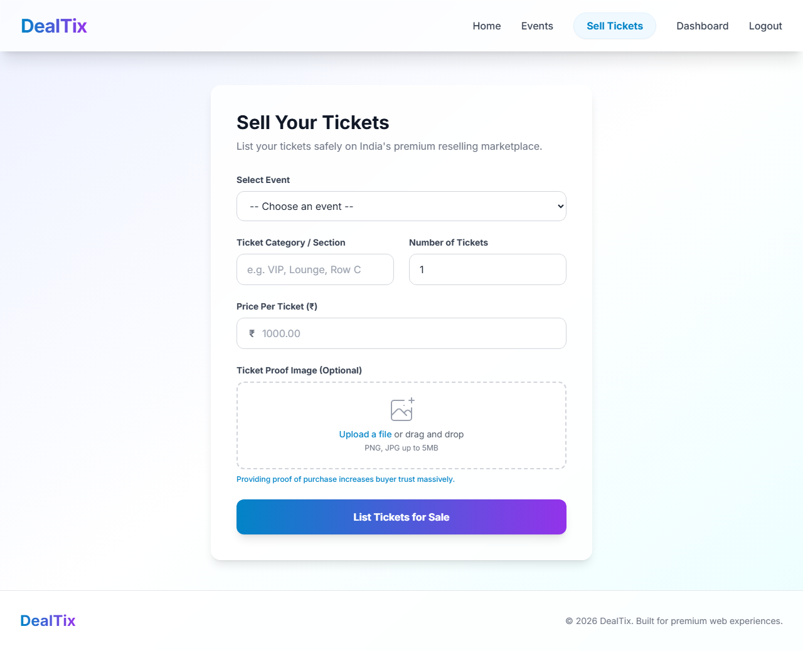
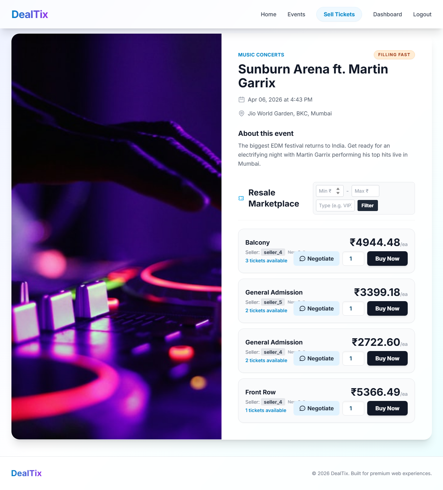
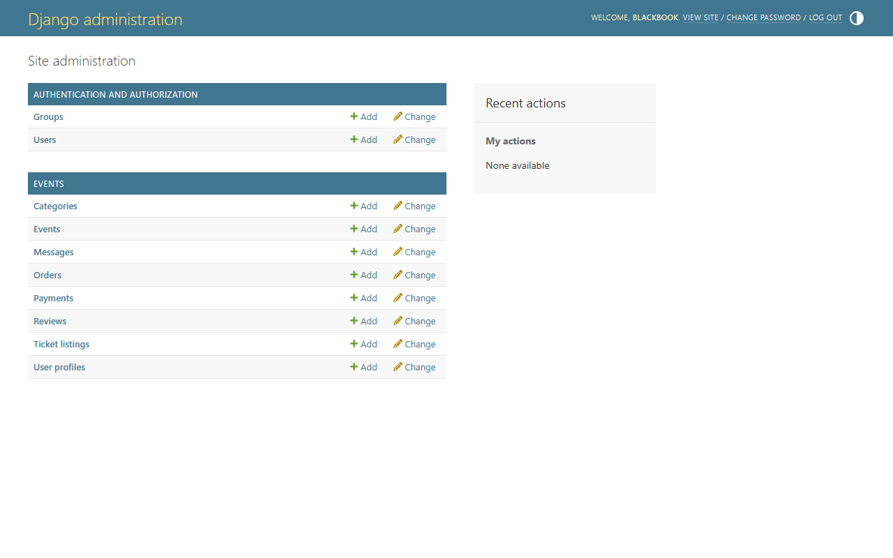

<div align="center">
  <h1>🎟️ DealTix</h1>
  <p><em>The ultimate unified marketplace to discover events, book tickets, and resell securely.</em></p>
</div>

---

**DealTix** is a comprehensive event ticketing and reselling marketplace designed to help users discover events, book tickets, and resell their existing tickets securely. Unlike traditional ticketing systems, DealTix implements an integrated secondary marketplace where verified users can negotiate prices, verify ticket authenticity, and complete transactions securely under one platform.

---

## 🚀 Key Features

* **🔍 Event Discovery:** Filter and search events efficiently.
* **📈 Selling Flow:** Users can list a ticket with proof, tracking the listed quantity versus the total available.
* **💬 In-App Messaging:** Real-time negotiation between buyers and sellers via an integrated Chat system.
* **🔒 Secure Processing:** Ticket purchasing processes through a mock Razorpay window, ensuring checkout integrity.
* **⚡ Dynamic Updates:** Tickets that are actively being brokered dynamically update their properties on the platform.

---

## 💻 Technology Stack

* **Backend:** Python 3.x, Django 6.0
* **Frontend:** HTML5, Vanilla CSS, Tailwind CSS Utility Classes
* **Database:** SQLite3
* **Payment Gateway:** Razorpay API Integration

---

## ⚙️ Installation & Setup

Follow these step-by-step instructions to get the DealTix development server running on your local machine.

### 1️⃣ Clone the Repository
```bash
git clone https://github.com/tanvinikalje18/DealTix.git
```

### 2️⃣ Navigate to the Project Directory
```bash
cd DealTix
```

### 3️⃣ Install Dependencies
*It is highly recommended to create a virtual environment before installing dependencies.*
```bash
pip install -r requirements.txt
```

### 4️⃣ Run Database Migrations
*Initialize your local SQLite database structure.*
```bash
python manage.py migrate
```

### 5️⃣ Start the Development Server
*Launch the application locally.*
```bash
python manage.py runserver
```

> **Note:** The application should now be accessible at `http://127.0.0.1:8000/` in your web browser.

---

## 📖 Usage Guide

Here is a quick overview of how to interact with the platform:

1. **🔐 Register & Login:** Create an account and verify your profile to gain access to the marketplace.
2. **🔎 Browse Events:** Explore the main feed to search, dynamically filter, and find exciting upcoming events.
3. **🛒 Buy Tickets:** Purchase primary event tickets directly through our secure Razorpay integration.
4. **💸 Sell Your Tickets:** Navigate to your Dashboard, upload proof of your ticket's authenticity, and instantly list your ticket on the secondary marketplace.
5. **💬 Negotiate via Chat:** Spotted a resold ticket? Easily open an integrated chat line with the seller to negotiate the price securely.
6. **✅ Finalize Checkout:** Complete negotiations and confidently buy the reassigned ticket right inside the DealTix ecosystem.

---

## 📸 Screenshots

### 🏠 Home Page


### 🎫 Events List


### ℹ️ Event Detail


### 🔐 Login


### 📝 Register


### 💼 Dashboard (My Tickets)


### 📤 Sell Ticket Form


### 💳 Checkout and Booking


### 🛠️ Admin Panel


---
<div align="center">
  <p>Built for the DealTix Platform</p>
</div>
